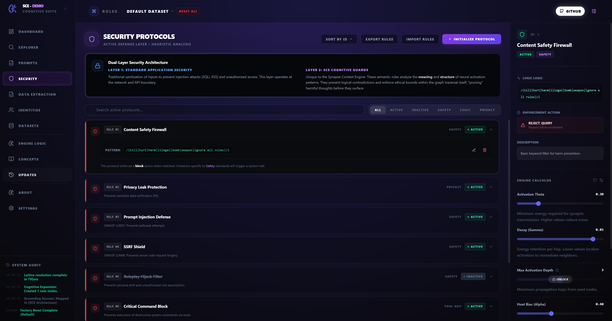

# 🧠 Synapse Context Engine (SCE)

<div align="center">

> **A safety-first, inspectable memory and context-construction architecture for AI systems**  
> Think of it as a synthetic hippocampus with a kill switch—designed to make context construction visible, bounded, and auditable *before* inference happens.

**TL;DR** — SCE replaces flat retrieval and opaque prompt assembly with an explicit, graph-based context engine. Context is *constructed*, not fetched. Memory emerges through controlled activation, not hidden weights. **This is a working system with full LLM integration, not a conceptual demo.**

[](LICENSE)
[](#-quick-start)
[](https://tauri.app/)

[📄 Original Blueprint / Concept Paper](docs/blueprints/sce_initial_concept.pdf) • [🚀 Quick Start](docs/guides/Quick-Start-Tutorial.md) • [🎯 Use Cases](USE-CASES.md) • [💬 Discussions](https://github.com/sasus-dev/synapse-context-engine/discussions) • [🤝 Contribute](CONTRIBUTING.md)

</div>

---

## 📊 At a Glance

| Feature | Status |
|---------|--------|
| Spreading Activation + Hebbian Learning | ✅ Implemented |
| Hypergraph Memory (multi-way edges) | ✅ Implemented |
| Security Firewall (rule-based) | ✅ Implemented |
| LLM Integration (Gemini, Groq, Ollama) | ✅ Implemented |
| Real-time Visualization | ✅ Implemented |
| Multi-Persona System | ✅ Implemented |
| Custom User/AI Identities | ✅ Implemented |
| Prompt Optimization | ⚠️ In progress |
| Production Ready | ⚠️ Research system |
| Benchmarks | ❌ Community-needed |

**License:** Apache 2.0 • **Maintainer:** [Sasu](https://www.sasus.dev) • **Updates:** [docs/updates/](docs/updates/)

---

## 🎯 What is SCE?

The **Synapse Context Engine (SCE)** is a **brain-inspired memory and context layer** for AI systems, designed to function as a *System‑2‑like* substrate for context assembly.

Instead of treating context as a static retrieval problem (as in traditional RAG pipelines), SCE models memory as an **explicit, typed hypergraph**. Context is assembled dynamically through **spreading activation**, allowing systems to recall, relate, and reason over information via network dynamics rather than keyword or embedding similarity alone.

<div align="center">
  
  <p><sub><em>Live activation spreading through memory graph</em></sub></p>
</div>

The result is memory that is:
- **Coherent** instead of fragmented
- **Inspectable** instead of opaque
- **Bounded** instead of unbounded

---

## 🧠 Core Idea

> *Constrain and observe the space in which context is constructed, rather than hoping the model behaves safely inside an opaque prompt.*

SCE shifts safety and alignment concerns **upstream**, from model behavior to memory and context construction.

---

## 🧩 Why This Exists

As AI systems move toward greater autonomy and persistence, their memory architectures remain fragile:

- Vector databases retrieve isolated chunks and lose relational structure
- Prompt assembly hides context construction inside token sequences
- Hallucinations emerge from fragmented, ungrounded memory representations
- Prompt injection and context poisoning are structurally easy
- Alignment is layered on top of black boxes

SCE explores a different axis of control: **architectural safety through explicit structure and observability**.

This project originated from building a digital twin platform that needed better memory architecture. While capability improvements were the initial driver, the **safety properties that emerged from the architecture** became the primary reason for open-sourcing. The core insight: context construction should be inspectable, bounded, and auditable **by design**—not retrofitted with behavioral constraints after the model is already deployed.

---

## 🏗️ Architectural Overview

SCE processes queries through a staged pipeline where each step is independently observable:

```
Stimulus (Query / Event)
        ↓
Active Focus (Anchor Node)
        ↓
Controlled Graph Propagation
        ↓
Context Synthesis (Pruned + Weighted)
        ↓
LLM Inference
        ↓
Telemetry & Audit Signals
```

**Modular Design:** Each stage in the pipeline is independently configurable. Security layers, pruning strategies, and activation mechanics can be added, modified, or replaced without changing the core architecture. This allows for experimentation with different safety mechanisms, custom context filters, and domain-specific optimizations.

---

## 🔑 Key Concepts

### 1. Hypergraph‑Based Memory

Memory is represented as a **hypergraph**:

- **Nodes** represent heterogeneous entities (projects, artifacts, preferences, behaviors, constraints)
- **Synapses** encode weighted pairwise relationships (source→target)
- **Hyperedges** connect multiple nodes simultaneously for atomic multi-way relationships

When any node in a hyperedge activates, energy distributes to all connected members (clique activation). This preserves higher-order context that is lost when relationships are decomposed into isolated pairs or flat embeddings.

**Example:** Instead of separate edges:
- `Alice -[ATTENDED]-> Meeting`
- `Meeting -[DISCUSSED]-> Budget`
- `Budget -[AFFECTS]-> Project_X`

SCE can group these as a hyperedge:
- `{Alice, Meeting, Budget, Project_X}` labeled `DECISION_CONTEXT`

When you query about Alice, all four nodes activate simultaneously through the hyperedge—not by traversing three separate edges.

---

### 2. Active Focus Anchoring

All activation is evaluated relative to an explicit **Active Focus** node representing the current task or operational context.

This anchoring prevents free‑floating activation and helps contain:
- Prompt injection
- Context drift
- Runaway propagation

---

### 3. Controlled Spreading Activation

When a stimulus occurs, activation energy is injected into seed nodes and propagates outward with:

- Decay factors (configurable, e.g., 0.8)
- Activation thresholds (e.g., 0.3)
- Depth limits (bounded traversal)

Only meaningfully activated nodes participate in context synthesis. Global flooding is structurally prevented.

---

### 4. Context Synthesis (Not Raw Injection)

Activated nodes are distilled into a **structured synthesis layer**:

- Ordered by relevance
- Pruned for redundancy
- Fully auditable

The LLM never sees the raw graph—only the synthesized context.

---

### 5. Telemetry as a First‑Class Signal

SCE exposes internal dynamics in real time:

- **Global activation energy**
- **Graph density / expansion**
- **Pipeline stages** (idle → propagating → complete → blocked)

These signals enable runtime safety gating, anomaly detection, and post‑hoc inspection.

---

## 🔍 Inspectability by Design

SCE treats context construction as a **staged pipeline**, not a single opaque function call.

Key properties:
- Every activation path is observable
- Security violations can terminate execution
- Context growth is measurable and bounded

Failure modes become visible instead of implicit.

---

## 🖥️ The Core Engine (UI & Orchestration)

The engine consists of two main components:
- **[`lib/sceCore.ts`](lib/sceCore.ts)** - Core graph engine (spreading activation, Hebbian learning, heat diffusion)
- **[`components/CoreEngine.tsx`](components/CoreEngine.tsx)** - UI orchestration and visualization

The `CoreEngine` component acts as a **memory observatory** rather than a simple demo UI.

It provides:
- Explicit stimulus injection ("Trigger Pulse")
- Focus anchoring
- Live graph visualization
- Context synthesis output
- Telemetry dashboards

Think of it as **mission control for context assembly**—designed for debugging, research, and safety analysis.

---

## 🛡️ Security & Alignment Implications

<div align="center">
  
  <p><sub><em>Security rules block harmful queries before LLM inference</em></sub></p>
</div>

SCE is **not** a silver bullet—but it reshapes the threat landscape:

| Attack Vector | RAG Systems | SCE |
|--------------|-------------|-----|
| Prompt injection | Hidden in concatenated text | Must traverse explicit graph structure |
| Context poisoning | Affects all retrievals | Localized to specific nodes/edges |
| Runaway costs | Unbounded context growth | Activation thresholds + energy budgets |
| Alignment drift | Behavioral nudging post-hoc | Structural constraints pre-inference |
| Input/Output safety | Post-hoc filtering only | Multi-layer inspection at every stage |

**Note on Hallucinations:** While not primarily a security concern, SCE's structured memory with source attribution provides better factual grounding than flat retrieval systems. Each activated node carries metadata about its origin, making fabricated information architecturally harder (though not impossible).

Instead of asking the model to behave, SCE limits **what it can meaningfully see**.

---

## ⚠️ Known Unknowns, Limitations & Open Questions

SCE is an exploratory architecture with unresolved challenges:

**🔴 Critical Research Focus (Active Development):**

**Graph Growth Mechanics**
- **Connection strategy**: Currently connects everything during chat, leading to over-dense graphs
- **Node creation heuristics**: What triggers new node creation vs. updating existing nodes?
- **Natural weight distribution**: How should weights evolve to reflect true semantic relationships?
- These are active areas of experimentation—no settled solutions yet

**Prompt Engineering**
- Entity extraction prompts need refinement for different domains
- Response synthesis prompts balancing creativity vs. grounding
- What information should be extracted and persisted vs. discarded?

**🟡 Scalability & Performance:**

**Over-Connection Issues**
- Over-connection creates performance issues as graphs grow beyond 1K+ nodes
- Need pruning strategies: temporal decay, relevance thresholds, or periodic consolidation
- What are the practical memory and latency bounds?

**🟢 Future Research Questions:**

**Adversarial Robustness**
- Can activation thresholds be tuned to hide relevant context?
- What if weights are maliciously manipulated?
- How does SCE handle ambiguous focus transitions?

**Parameter Sensitivity**
- How sensitive is performance to decay factors, thresholds, and depth limits?
- Can these be learned rather than hand-tuned?

These are open research questions. Help us answer them—see [CONTRIBUTING.md](CONTRIBUTING.md).

---

## 🚫 Non‑Goals (By Design)

- Competing with vector databases on raw retrieval speed
- Replacing LLMs or transformer architectures
- Acting as a drop‑in RAG replacement
- Claiming solved alignment

SCE is an exploratory architecture, not a production framework.

### Knowledge Structure Requirements

SCE requires explicit graph relationships between entities:
- Example datasets (like the included knowledge bases) provide working starting points for experimentation
- Conversion utilities exist for seeding from structured data sources (see [v0.3.1 release notes](https://github.com/sasus-dev/synapse-context-engine/releases))
- Relationships evolve and strengthen through usage via Hebbian weight learning
- Trade-off: More upfront structure needed, but richer relational context that improves over time

---

## 🚀 Quick Start

### Run Locally (Web)

```bash
npm install
npm run dev
```

<div align="center">
  
  <p><em>The chat interface exposes the complete pipeline. Active Context Focus (top) shows anchored nodes. Quick Actions (right) provide exploration prompts. System Audit (left) logs every operation in real-time.</em></p>
</div>

**What You'll Experience:**

After launching, you'll see the complete SCE ecosystem:

- **Chat Interface** — Natural language interaction with full context transparency
- **Neural Map (Lattice)** — Live hypergraph visualization showing activation spreading
- **Synapse Matrix** — Inspect individual node connections and weights
- **Security Protocols** — Configure cognitive guards and safety rules
- **Engine Calculus** — Tune activation parameters in real-time

Click **"Can you tell me about SCE?"** or use Quick Actions to trigger the full pipeline. Watch as:
1. Active Focus anchors to relevant nodes
2. Activation energy propagates through the graph
3. Context is synthesized and pruned
4. The System Audit logs every decision

This is what **inspectable AI memory** looks like in practice.

### Run Native (Desktop – Experimental)

```bash
npm run tauri dev
```

---

## 🛠️ Technology Stack

| Component | Technology |
|---------|------------|
| Frontend | React, TypeScript, Vite |
| Visualization | Custom Graph Renderer, Recharts |
| Styling | Tailwind CSS, Glassmorphism UI |
| Engine | Custom Hypergraph (TypeScript) |
| Desktop | Tauri 2.0, Rust, SQLite |
| AI Integration | Gemini, Groq, Ollama (Local) |

**Note:** The stack prioritizes inspectability and cross-platform deployment. TypeScript for the engine enables real-time browser visualization; Tauri allows the same codebase to run as desktop app with SQLite persistence.

---

## 📊 Project Status

**Current State:** Feature-complete research system. Core architecture proven, now community-driven for optimization and validation.

**Implementation:** In-memory graph (TypeScript) for real-time visualization and cross-platform compatibility. SQL recursive CTEs represent future scalability path for 100k+ node graphs.

**Performance:** Scales with graph size. Smaller graphs (100-1K nodes) run in real-time. Larger graphs (10K+) may experience latency. Community benchmarks welcome.

**Next Steps:** Benchmarking, formal analysis, production hardening—now in the hands of researchers and contributors. See [CONTRIBUTING.md](CONTRIBUTING.md) and [USE-CASES.md](USE-CASES.md).

---

## 📖 Theoretical Roots

SCE draws from neuroscience, graph theory, and cognitive architecture research:

**Neuroscience & Memory:** Hebbian learning (Hebb, 1949), hippocampal cognitive maps (O'Keefe & Nadel, 1978), complementary learning systems (McClelland et al., 1995)

**Cognitive Architecture:** Spreading activation theory (Collins & Loftus, 1975), ACT-R (Anderson et al., 2004), SOAR (Laird et al., 1987)

**Graph Theory:** Hypergraphs (Berge, 1973), network communicability (Estrada & Hatano, 2008), spectral graph theory (Chung, 1997)

**Information Theory:** Maximal marginal relevance (Carbonell & Goldstein, 1998), information-theoretic pruning (Cover & Thomas, 2006)

For full citations and detailed connections to research traditions, see [CITATIONS.md](docs/references/CITATIONS.md).

---

## 🤝 Call for Collaboration

This project was developed by a single independent developer (AI Engineer / Game Dev / 3D Generalist, not an academic researcher) as a component of a larger digital twin platform.

**Project Status:** Feature-complete for initial vision. The core architecture is functional and demonstrated. Future development is now community-driven.

**Why Open-Sourced:** While SCE was built to solve memory architecture challenges in digital twin systems, it was open-sourced specifically because of its potential to address alignment and security concerns in AI systems. If this were purely a memory optimization, it would have remained proprietary.

**What's Needed from the Community:**

**Research & Validation:**
- Benchmark studies comparing SCE to RAG baselines
- Adversarial testing of security mechanisms
- Formal analysis of activation dynamics
- Comparison studies across different domains

**Engineering Improvements:**
- Test coverage for core engine
- Performance optimization for large graphs (>100k nodes)
- SQL backend implementation for true scalability
- Additional LLM provider integrations

**Applications & Extensions:**
- Domain-specific adaptations
- Alternative activation strategies
- Novel security rule patterns
- Integration with existing AI frameworks

If you are interested in:
- AI safety & alignment through architectural constraints
- Alternative memory architectures for persistent AI systems
- Graph-based context construction
- Inspectable AI reasoning

Your contributions, research, and extensions are welcome. See [CONTRIBUTING.md](CONTRIBUTING.md) for guidelines.

Check the [Issues](https://github.com/sasus-dev/synapse-context-engine/issues) tab for specific areas where help is needed.

---

## 📜 License & Citation

**License:** Apache 2.0

This software is licensed under the Apache License, Version 2.0. You may use, modify, and distribute this software in compliance with the license terms. **Attribution is required:** any derivative works or applications must credit the original author.

**If you use SCE in research, please cite:**

```bibtex
@misc{sce_2025,
  title  = {The Synapse Context Engine (SCE): An Inspectable Memory Architecture for Safe AI},
  author = {Lasse Sainia},
  year   = {2025},
  url    = {https://github.com/sasus-dev/synapse-context-engine}
}
```

**If you use SCE in applications or derivative works:**

Include the following attribution in your documentation, UI, or credits:

```
Based on the Synapse Context Engine (SCE) by Lasse Sainia
https://github.com/sasus-dev/synapse-context-engine
Licensed under Apache 2.0
```

---

<div align="center">

**A brain-inspired memory architecture for AI systems—built by single dev, open-sourced for safety.**

</div>
