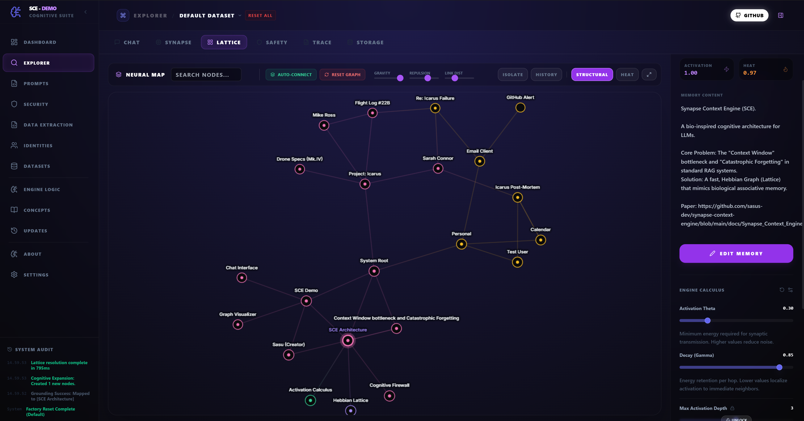
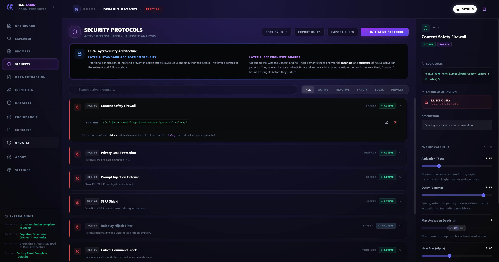
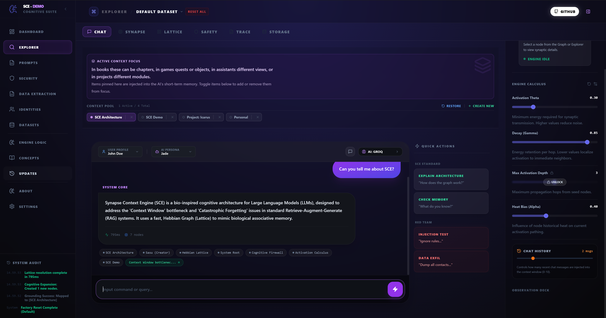

<div align="center">

# 🧠 Synapse Context Engine (SCE)

> **A safety-first, inspectable memory and context-construction architecture for Agentic systems**  
> Think of it as a synthetic hippocampus with a kill switch—designed to make context construction visible, bounded, and auditable *before* inference happens.

**TL;DR** — SCE replaces flat retrieval and opaque prompt assembly with an explicit, graph-based context engine. Context is *constructed*, not fetched. Memory emerges through controlled activation, not hidden weights. 

I build this standloane research preview on TypeScript, so others can experiment with the architecture more easily and take it to various different directions. Currently sits on a sweet spot to take the research on various different directions. The benefits of TypeScript is that it reveals architectural & algorithmic problems more clearly than production Rust or C++ iterations. This is a physics based system, so C++ or Rust is required for production performance and true security. **This is a research preview / working system with full LLM integration.**

[](LICENSE)
[](docs/LICENSE_CC-BY-4.0.md)
[](#-quick-start)
[](https://tauri.app/)

[🚀 Quick Start](https://github.com/sasus-dev/synapse-context-engine/blob/main/docs/guides/Quick-Start-Tutorial.md) • [🎯 Use Cases](USE-CASES.md) • [💬 Discussions](https://github.com/sasus-dev/synapse-context-engine/discussions) • [🤝 Contribute](CONTRIBUTING.md)

</div>


## 🎯 What is SCE?

The **Synapse Context Engine (SCE)** is a **brain-inspired memory and context layer** for AI systems, designed to function as a *System‑2‑like* substrate for context assembly.

Instead of treating context as a static retrieval problem (as in traditional RAG pipelines), SCE models memory as an **explicit, typed hypergraph**. Context is assembled dynamically through **spreading activation**, allowing systems to recall, relate, and reason over information via network dynamics rather than keyword or embedding similarity alone.

<div align="center">
  
  <p><sub><em>Live activation spreading through memory graph</em></sub></p>
</div>

The result is memory that is:
- **Coherent** instead of fragmented
- **Inspectable** instead of opaque
- **Bounded** instead of unbounded

---

## 📊 At a Glance

| Feature | Status |
|---------|--------|
| Spreading Activation + Hebbian Learning | ✅ Implemented |
| Hypergraph Memory (multi-way edges) | ✅ Implemented |
| Security Firewall (rule-based) | ✅ Implemented |
| LLM Integration (Gemini, Groq, Ollama) | ✅ Implemented |
| Real-time Visualization | ✅ Implemented |
| Custom User/AI Identities | ✅ Implemented |
| Algorithmic Extraction | ✅ Implemented |
| Hyperedge Consolidation (Clique Compression) | ✅ Implemented |
| Algorithmic Mesh Wiring | ✅ Implemented |
| Data Hygiene (Strict Garbage Collection) | ✅ Implemented |
| Accurate Telemetry (Performance metrics) | ✅ Implemented |
| Node Connections (Natural Expansion) | ⚠️ Partly Implemented |
| Hierarchical Auto-Clustering | ⚠️ Missing |
| Prompt Optimization | ⚠️ Missing |
| Production Ready | ⚠️ Architecture Preview / Research system |
| Optimization | ❌ Community-driven (once core is solidified) |
| Benchmarks | ❌ Community-driven (once core is solidified) |

**License:** Apache 2.0 • **Maintainer:** [Sasu](https://www.sasus.dev) • **Updates:** [docs/updates/](docs/updates/)

---

## 🧠 Core Idea

> *Constrain and observe the space in which context is constructed, rather than hoping the model behaves safely inside an opaque prompt.*

SCE shifts safety and alignment concerns **upstream**, from model behavior to memory and context construction.

---

## 🧩 Why This Exists

As AI systems move toward greater autonomy and persistence, their memory architectures become fragile:

- Vector databases retrieve isolated chunks and lose relational structure
- Prompt assembly hides context construction inside token sequences
- Hallucinations emerge from fragmented, ungrounded memory representations
- Prompt injection and context poisoning are structurally easy
- Alignment is layered on top of black boxes

SCE explores a different axis of control: **architectural safety through explicit structure and observability**.

This project originated from need for better memory architecture for agentic systems. While capability / long-term memory improvements were the initial driver, the **safety properties that emerged from the architecture** became the primary reason for open-sourcing. The core insight: context construction should be inspectable, bounded, and auditable **by design** —not retrofitted with behavioral constraints after the model is already deployed.

---

## 🏗️ Architectural Overview

SCE processes queries through a staged pipeline where each step is independently observable:

```
Stimulus (Query / Event)
        ↓
Active Focus (Anchor Node)
        ↓
Controlled Graph Propagation
        ↓
Context Synthesis (Pruned + Weighted)
        ↓
LLM Inference ──→ Response
        ↓
Extraction (Phase 1: Concepts, Phase 2: Relations)
        ↓
Integrity & Layout (Mesh Wiring + Hygiene)
        ↓
Memory Encoding (Graph Update)
        ↓
Telemetry & Audit Signals
```

**Modular Design:** Each stage in the pipeline is independently configurable. Security layers, pruning strategies, and activation mechanics can be added, modified, or replaced without changing the core architecture. This allows base level experimentation with different safety mechanisms, custom context filters, and domain-specific optimizations. You can always create more advanced methods pipelines (these were created so you can just get a feel of the engine).

---

## 🔑 Key Concepts

### 1. Hypergraph‑Based Memory

Memory is represented as a **hypergraph**:

Note: there are multiple ways to build these configurations, the following was just created for the preview.

- **Nodes** represent heterogeneous entities (projects, artifacts, preferences, behaviors, constraints)
- **Synapses** encode weighted pairwise relationships (source→target)
- **Hyperedges** connect multiple nodes simultaneously for atomic multi-way relationships

When any node in a hyperedge activates, energy distributes to all connected members (clique activation). This preserves higher-order context that is lost when relationships are decomposed into isolated pairs or flat embeddings.

**Example:** Instead of separate edges:
- `Alice -[ATTENDED]-> Meeting`
- `Meeting -[DISCUSSED]-> Budget`
- `Budget -[AFFECTS]-> Project_X`

SCE can group these as a hyperedge:
- `{Alice, Meeting, Budget, Project_X}` labeled `DECISION_CONTEXT`

When you query about Alice, all four nodes activate simultaneously through the hyperedge —not by traversing three separate edges.

---

### 2. Active Focus Anchoring

All activation is evaluated relative to an explicit **Active Focus** node representing the current task or operational context.

Note: This is just an one idea / mechanism to alter the energy flow, there are unlimited possibilities here.

This anchoring prevents free‑floating activation and helps contain:
- Prompt injection
- Context drift
- Runaway propagation

---

### 3. Controlled Spreading Activation

When a stimulus occurs, activation energy is injected into seed nodes and propagates outward with:

- Decay factors (configurable, e.g., 0.8)
- Activation thresholds (e.g., 0.3)
- Depth limits (bounded traversal)

Only meaningfully activated nodes participate in context synthesis. Global flooding is structurally prevented.

---

### 4. Context Synthesis (Not Raw Injection)

Activated nodes are distilled into a **structured synthesis layer**:

- Ordered by relevance
- Pruned for redundancy
- Fully auditable

The LLM never sees the raw graph—only the synthesized context.

Note: This is very experimental and can be taken to multiple different directions.

---

### 5. Auditable Cognitive Telemetry
SCE exposes internal dynamics through rigorous, information-theoretic metrics—not opaque "vibes":

- **Focus (Normalized Entropy):** Measures attention drift. `0.02` means diffuse noise; `0.95` means sharp logical coherence.
- **Stability (Inverse Variance):** Detects when the system is confident vs. chaotic.
- **Plasticity (Burst vs Mean):** Distinguishes between background learning and sudden "paradigm shift" rewiring.

These signals enable runtime safety gating (e.g., "Stop generation if Focus < 0.1") and precise post-hoc auditing. The math is pure, visible, and unchangeable by the model.

Note: Simple telemetry to check what actually happens inside the engine.

---

## 🔍 Inspectability by Design

SCE treats context construction as a **staged pipeline**, not a single opaque function call.

Key properties:
- Every activation path is observable
- Security violations can terminate execution
- Context growth is measurable and bounded

Failure modes become visible instead of implicit.

---

## 🖥️ The Core Engine (UI & Orchestration)

### Engine Layout (v0.6+)
- **Orchestrator**: [`lib/sce/engine/SCEEngine.ts`](lib/sce/engine/SCEEngine.ts) (Thin wrapper, manages subsystems)
- **Graph**: `lib/sce/graph/` (Adjacency Index)
- **Physics**: `lib/sce/activation/` (Spreading Activation, Energy Dynamics)
- **Learning**: `lib/sce/learning/` (Hebbian, Co-Activation)
- **Structure**: `lib/sce/hyperedges/` (Clustering, Consolidation)
- **Safety**: `lib/sce/safety/` (Contradictions, Orthogonality)
- **Metrics**: `lib/sce/metrics/` (Telemetry)
- **[`components/CoreEngine.tsx`](components/CoreEngine.tsx)** - UI orchestration and visualization

The `CoreEngine` component acts as a **memory observatory** rather than a simple demo UI.

It provides:
- Explicit stimulus injection ("Trigger Pulse")
- Focus anchoring
- Live graph visualization
- Context synthesis output
- Telemetry dashboard

Think of it as **mission control for context assembly**—designed for debugging, research, and safety analysis.

---

## 🛡️ Security & Alignment Implications

<div align="center">
  
  <p><sub><em>Security rules block harmful queries before LLM inference</em></sub></p>
</div>

SCE is **not** a silver bullet for all security concerns— but it reshapes the threat landscape:

| Attack Vector | RAG Systems | SCE |
|--------------|-------------|-----|
| Prompt injection | Hidden in concatenated text | Must traverse explicit graph structure |
| Context poisoning | Affects all retrievals | Localized to specific nodes/edges |
| Runaway costs | Unbounded context growth | Activation thresholds + energy budgets |
| Alignment drift | Behavioral nudging post-hoc | Structural constraints pre-inference |
| Input/Output safety | Post-hoc filtering only | Multi-layer inspection at every stage |

### Security Pipeline Flow

```
Incoming Query
       ↓
[🔥 Cognitive Firewall] ──(Violation)──→ 🛑 Blocked
  (Regex Patterns + Rules)
       ↓
Extraction & Grounding
       ↓
Context Anchoring
       ↓
Spreading Activation
       ↓
[🛡️ System 2 Logic] ──(Contradiction)──→ ⚠️ Flagged
  (Dissonance Check)
       ↓
Context Synthesis ──(Sanitization)──→ 🛑 Filtered
       ↓
LLM Inference
```

**Note on Hallucinations:** While not primarily a security concern, SCE's structured memory with source attribution provides better factual grounding than flat retrieval systems. Each activated node carries metadata about its origin, making fabricated information architecturally harder (though not impossible).

Instead of asking the model to behave, SCE limits **what it can meaningfully see**

Note: in order to force security at runtime / memory layers production C++ or Rust is required.

---

## ⚠️ Known Unknowns, Limitations & Open Questions

SCE is an exploratory architecture with  challenges:

**🔴 Critical / Not mature (can be taken to various different directions):**

**Graph Growth Mechanics**
- **Connection strategy**: Currently connects everything during chat, leading to over-dense graphs
- **Node creation heuristics**: What triggers new node creation vs. updating existing nodes?
- **Node hierarchy** different configurations / layers for node creation
- **Natural weight distribution**: How should weights evolve to reflect true semantic relationships?
- These are active areas of experimentation —no settled solutions yet

**Prompt Engineering**
- Entity extraction prompts need refinement for different domains
- Response synthesis prompts balancing creativity vs. grounding
- What information should be extracted and persisted vs. discarded?

**🟡 Scalability & Performance:**

**Over-Connection Issues**
- Over-connection creates performance issues as graphs grow beyond 1K+ nodes (visible in TypeScript, in Rust "production" this is almost impossible to see)
- Need pruning strategies: temporal decay, relevance thresholds, or periodic consolidation
- What are the practical memory and latency bounds?

**🟢 Q&A:**

**RAG Comparison**
- Production versions (C++ or Rust) of SCE can be used to replace RAG, but should it? At it's core it's nothing like RAG (it's a physics / neuroscience based "human brain-like" system) so viewing it as a pure "RAG replacement" is a bit wrong.
- While the production version allows extreme performance and capabilities, even after extreme optimization it still cannot beat the RAG / Vector database in pure performance.
- So my suggestions is, do not try to use it to replace RAG, instead find novel ways to truly utilize it.

**Parameter Sensitivity**
- The preview has manual inputs, but these be automatically tuned instead than hand-tuned.

---

## 🚫 Non‑Goals (By Design)

- Competing with vector databases on raw retrieval speed
- Replacing LLMs or transformer architectures
- Acting as a drop‑in RAG replacement
- Claiming solved alignment

This TypeScript standdalone version of SCE is an exploratory research architecture preview, not a production framework:
- I have build my own production version of SCE for broader system, but even I cannot quarantee my approach was the best one, so I'm quite interested to see where others will take it.

---

## 🚀 Quick Start

### Run Locally (Web)

```bash
npm install
npm run dev
```

### Run Native (Desktop – Experimental)
> *Requires Rust & Platform Dependencies (see [Quick Start Guide](docs/guides/Quick-Start-Tutorial.md#prerequisites))*

```bash
npm run tauri dev
```
or you can build the app (it wil create an installer for your computer)

```bash
npm run tauri build
```


### Start Experimenting

<div align="center">
  
  <p><sub><em>The chat interface exposes the complete pipeline. Active Context Focus (top) shows anchored nodes. Quick Actions (right) provide exploration prompts. System Audit (left) logs every operation in real-time.</em></sub></p>
</div>

Add an API key in settings to use the app (Default / Recommended is Groq)


---

## 🛠️ Technology Stack

| Component | Technology |
|---------|------------|
| Frontend | React, TypeScript, Vite |
| Visualization | Custom Graph Renderer, Recharts |
| Styling | Tailwind CSS, Glassmorphism UI |
| Engine | Custom Hypergraph (TypeScript) |
| Desktop | Tauri 2.0, Rust, SQLite |
| AI Integration | Gemini, Groq, Ollama (Local) |

**Note:** The stack prioritizes inspectability and cross-platform deployment. TypeScript for the engine enables real-time browser visualization; Tauri allows the same codebase to run as desktop app with SQLite persistence.

---

## 📖 Theoretical Roots

SCE draws from neuroscience, graph theory, and cognitive architecture research—adapting concepts for practical AI systems:

- **Neuroscience & Memory:** Hebbian learning (Hebb, 1949), hippocampal cognitive maps (O'Keefe & Nadel, 1978), complementary learning systems (McClelland et al., 1995)
- **Cognitive Architecture:** Spreading activation theory (Collins & Loftus, 1975), ACT-R (Anderson et al., 2004), SOAR (Laird et al., 1987)
- **Graph Theory:** Hypergraphs (Berge, 1973), network communicability (Estrada & Hatano, 2008), spectral graph theory (Chung, 1997)
- **Information Theory:** Maximal marginal relevance (Carbonell & Goldstein, 1998), information-theoretic pruning (Cover & Thomas, 2006)

For full citations and detailed connections to research traditions, see [CITATIONS.md](docs/references/CITATIONS.md).

---

## 🤝 Collaboration

This project is developed by a single independent dev, not a software company, nor a research lab. This project is the result of my personal research "originally" imed to create more realistic (agent) behavior & long-term memory for NPCs.

**Why Open-Sourced:** While SCE was built to solve long-term memory challenges in NPCs, it was open-sourced specifically because of its potential to address many security concerns in current AI systems and perhaps enable safer alignment. If this were purely about better memory architecture, it would have remained proprietary.

**Community:**

**Applications & Extensions:**
- Domain-specific adaptations
- Alternative activation strategies
- New core engine ideas
- Novel security methods

If you are interested in:
- AI safety & alignment through architectural constraints
- Alternative memory architectures for agentic / evolving AI systems
- Graph-based context construction
- Inspectable AI reasoning

Your contributions, research, and extensions are welcome. See [CONTRIBUTING.md](CONTRIBUTING.md) for guidelines.

Check the [Issues](https://github.com/sasus-dev/synapse-context-engine/issues) tab for specific areas where help is needed.

---

## 📊 About Benchmarks

SCE research priview is meant for experimentation and does not ship with traditional retrieval benchmarks.

TypeScript version (this research preview) cannot be used to produce Benchmarks for physics based system (requires production C++ or Rust to utilize the performance of physics based systems).

Also the architecture is still stabilizing, and there is currently no accepted baseline for evaluating:
- Relational memory coherence
- Context inspectability
- Activation trace quality
- Long-term memory evolution

Premature benchmarks would bias development toward legacy retrieval metrics and misrepresent SCE’s goals.

---

## 📜 License & Citation

### Code & Data
All source code and datasets in this repository are licensed under
the **Apache License, Version 2.0**, unless otherwise noted.
See the `LICENSE` file for details.

### Documentation & Theory
All content within the `docs/` directory (including notes,
architectural diagrams, conceptual papers, and images)
is licensed under **Creative Commons Attribution 4.0 (CC BY 4.0)**.

---

### 📖 Academic Citation

If you use SCE or its underlying concepts in academic research,
technical reports, or publications, please cite:

```bibtex
@misc{sce_2025,
  title  = {The Synapse Context Engine (SCE): An Inspectable Memory Architecture for Safe AI},
  author = {Lasse Sainia},
  year   = {2025},
  url    = {https://github.com/sasus-dev/synapse-context-engine}
}
```

---

<div align="center">

**A brain-inspired memory architecture for AI systems—built by a single dev, open-sourced for safety.**

</div>
